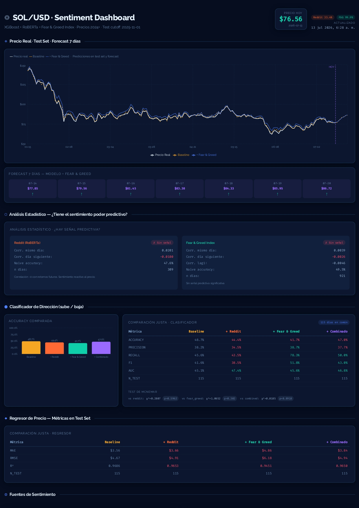
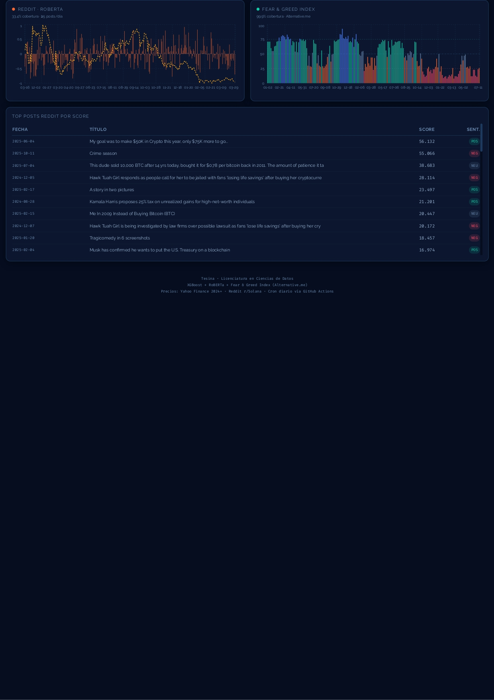

<!-- Only 3 FILL markers remain: dashboard screenshot, thesis PDF link, license. Delete this comment before publishing. -->

# SOL Sentiment Dashboard

**Does social-media sentiment actually help predict crypto prices? An end-to-end ML system that answers with a rigorous "no" — for Solana, at daily-to-weekly horizons.**

[](https://sol-sentiment-dashboard-ucasal.vercel.app)
[](.github/workflows)
[](requirements.txt)

**Live dashboard:** [sol-sentiment-dashboard-ucasal.vercel.app](https://sol-sentiment-dashboard-ucasal.vercel.app) — still ingesting and re-scoring every day, unattended, since the thesis was submitted.

 <!-- FILL: take a screenshot of the live dashboard and save it as docs/screenshot.png -->


B.Sc. thesis in Data Science — Universidad Católica de Salta (UCASAL), 2026. Advisor: Mg. Ing. Gustavo Rivadera.

---

## TL;DR — Key result

Under a fair, fixed-cutoff evaluation, **neither Reddit sentiment (RoBERTa-scored posts from r/Solana and related subs) nor the Crypto Fear & Greed Index improved next-day SOL/USD prediction over a price-only baseline.** McNemar's test confirmed that no difference was statistically significant (all p ≥ 0.30), and a horizon sensitivity analysis extended the null result out to 7-day horizons.

This is a *negative result by design, not by accident*: all four models share identical hyperparameters, an identical fixed cutoff (November 1, 2025), and an identical 115-day common test set — criteria defined a priori to prevent p-hacking. In a field full of leaky backtests and cherry-picked windows, the honest answer to "does sentiment add signal at a daily horizon?" turned out to be **no** — and the pipeline that proves it still runs automatically every day.

## Results

**Classification — next-day direction (fair test, 115 common days):**

| Model | Accuracy | F1 | AUC | McNemar vs. baseline (p) |
|---|---:|---:|---:|---:|
| **Baseline (price-only)** | **48.7 %** | 0.416 | 0.451 | — |
| + Reddit sentiment | 44.4 % | 0.385 | 0.474 | 0.596 |
| + Fear & Greed | 41.7 % | 0.518 | 0.456 | 0.302 |
| + Both (combined) | 47.0 % | 0.430 | 0.468 | 0.892 |

**Regression — next-day return, reconverted to price (fair test, 115 common days):**

| Model | MAE (USD) | RMSE (USD) | R² |
|---|---:|---:|---:|
| **Baseline (price-only)** | **3.56** | **4.67** | **0.969** |
| + Reddit sentiment | 3.66 | 4.91 | 0.965 |
| + Fear & Greed | 4.87 | 6.18 | 0.945 |
| + Both (combined) | 3.84 | 4.93 | 0.965 |

Reading the tables honestly: no model clears the 50 % coin-flip floor on direction, and every AUC sits near 0.5. Fear & Greed's inflated F1 comes from a 78.3 % recall at 38.7 % precision — it simply predicts "up" too often. The high R² across the board reflects daily price autocorrelation, not skill; that is exactly why the thesis targets **returns**, not price levels.

**Why the models can't win — the signal isn't there.** Sentiment–next-day-return correlations are essentially zero (Reddit r = −0.010 over 309 days; Fear & Greed r = −0.003 over 817 days), and naïvely following the sentiment sign yields 47.6 % / 49.1 % accuracy — *worse than a coin flip*. A sensitivity analysis over horizons t+1 … t+7 and extended sentiment lags found no horizon where sentiment helps; the only statistically significant results ran in the *opposite* direction (combined model worse at t+5, p = .037; extended-lag Reddit variant −27.5 pp, p < .001 — extra sentiment features add noise and overfitting, not signal).

**Interpretation.** Five concurrent causes, documented in the thesis: sentiment is reactive/coincident rather than leading; Reddit's usable coverage is only 37.7 % of days (≥5 posts/day filter) and its historical density is asymmetric; the crypto market prices public sentiment in before a 1-day lag can exploit it; a well-built 7-feature technical baseline leaves little headroom; and RoBERTa's tweet→Reddit domain transfer is imperfect.

## Why this project exists

Most "crypto price prediction with sentiment" projects share the same flaws: models compared on different splits, features leaking future information, and metrics reported only for the best run. This project does the boring things right — one fixed cutoff, identical preprocessing and hyperparameters for every model (XGBoost: 150 trees, depth 3, lr 0.08, seed 42), lag-1 sentiment with no lookahead, McNemar's paired test on a common evaluation set — and publishes whatever the answer turns out to be. It also doubles as a production exercise: the whole system ingests, scores, predicts, exports, and redeploys **daily, unattended**.

## Architecture

```
   ┌──────────────┐   ┌───────────────────────┐   ┌─────────────────────┐
   │  yfinance     │   │  Reddit (PRAW)        │   │ alternative.me      │
   │  SOL/USD OHLC │   │  r/Solana + related   │   │ Fear & Greed index  │
   │  820 days     │   │  6,490 unique posts   │   │ 2,977 daily records │
   └──────┬────────┘   └──────────┬────────────┘   └──────────┬──────────┘
          │                       │                           │
          │              ┌────────▼─────────┐                 │
          │              │ Sentiment scoring │                │
          │              │ cardiffnlp RoBERTa│                │
          │              │ score-weighted,   │                │
          │              │ ≥5 posts/day      │                │
          │              └────────┬─────────┘                 │
          ▼                       ▼                           ▼
   ┌───────────────────────────────────────────────────────────────┐
   │  Feature engineering — 7 technical features + lag-1 sentiment │
   │  aggregates (time-aware merge, no lookahead)                  │
   └────────────────────────────┬──────────────────────────────────┘
                                ▼
   ┌───────────────────────────────────────────────────────────────┐
   │  4 XGBoost variants — Baseline | Reddit | F&G | Combined      │
   │  fixed cutoff 2025-11-01 · fair test on 115 common days       │
   │  McNemar paired significance testing                          │
   └────────────────────────────┬──────────────────────────────────┘
                                ▼
                 export_for_dashboard.py → dashboard_data.json
                                ▼
   ┌───────────────────────────────────────────────────────────────┐
   │  React + TypeScript + Recharts dashboard on Vercel            │
   └───────────────────────────────────────────────────────────────┘

   GitHub Actions cron (daily_update.yml, 06:00 UTC) runs the whole
   pipeline end-to-end and triggers a Vercel redeploy.
```

## Dashboard

The [live dashboard](https://sol-sentiment-dashboard-ucasal.vercel.app) shows the price history with the train/test cut, test-set predictions per model, 7-day forecast cards, the full fair-test metric tables (classification, regression, and McNemar), Reddit sentiment with per-post breakdown, the Fear & Greed series, feature importances, and sentiment–return correlation statistics. Because the pipeline keeps running daily, the live coverage and correlation figures drift slightly from the frozen thesis numbers above.

## Tech stack

**Data & ML (Python):** pandas, NumPy, XGBoost, scikit-learn, SciPy (McNemar), `cardiffnlp/twitter-roberta-base-sentiment-latest` via Hugging Face Transformers (PyTorch, CPU inference — full corpus scores in ~15 min), PRAW, yfinance.
**Automation:** GitHub Actions (`daily_update.yml`, daily cron 06:00 UTC, auto-commit + Vercel redeploy).
**Dashboard (TypeScript):** React, Recharts, deployed on Vercel.

## Repository layout

```
.
├── .github/workflows/daily_update.yml   # daily pipeline (cron 06:00 UTC)
├── src/                                 # ingestion + sentiment + modeling scripts
├── data/                                # CSVs and dashboard_data.json
├── dashboard/                           # React app (deployed to Vercel)
├── export_for_dashboard.py              # modeling + fair test + JSON export
├── get_fear_greed.py                    # Fear & Greed ingestion (incremental)
├── setup.sh
└── requirements.txt
```

## Quickstart

**1. Python pipeline**

```bash
git clone https://github.com/bautiaraujo/sol-sentiment-dashboard.git
cd sol-sentiment-dashboard
./setup.sh                      # Python 3.10+, installs requirements.txt
```

Set your Reddit API credentials (create an app at reddit.com/prefs/apps):

```bash
export REDDIT_CLIENT_ID=...
export REDDIT_CLIENT_SECRET=...
export REDDIT_USER_AGENT=...
```

Run the pipeline in order:

```bash
python get_prices.py            # SOL/USD daily closes (yfinance)
python get_reddit_extended.py   # multi-subreddit, multi-keyword collection
python sentiment.py             # RoBERTa scoring (batched, CPU)
python get_fear_greed.py        # F&G index (incremental)
python export_for_dashboard.py  # 4 models + fair test + JSON export
```

**2. Dashboard**

```bash
cd dashboard
npm install
npm run dev                     # http://localhost:3000
```

Reproducibility: `random_state = 42` everywhere; results are bit-for-bit reproducible on the same input data.

## Methodology notes

- **Fixed-cutoff protocol.** One a-priori cutoff (2025-11-01) splits train/test for *every* model. No split is chosen after seeing results.
- **Fair test.** Models have unequal data coverage (100 % vs. 37.7 %), so all comparisons run on the intersection of 115 days where every model has complete features — the paired setting McNemar's test requires.
- **No lookahead.** Sentiment enters with an explicit lag: day *t* sentiment predicts day *t+1*. Daily Reddit scores are upvote-weighted means over days with ≥5 posts.
- **Returns, not levels.** Predicting % returns keeps the series near-stationary and stops price autocorrelation from masquerading as skill — critical when the test regime falls from ~$200 to ~$83.
- **Honest baselines.** Seven technical features (returns, moving averages, volatility, momentum) define the bar; sentiment has to *beat* them, not just perform "well."

## Limitations & future work

Daily granularity may be too coarse if sentiment's shelf life is measured in hours; coverage is limited to Reddit (no X/Discord/Telegram); RoBERTa was fine-tuned on tweets, not Reddit prose; and the test window is a single bear regime. Natural next steps from the thesis: intraday data, event-study designs around sentiment spikes, domain-specific fine-tuning, attention-based temporal models, and regime-dependent modeling.

## Thesis

This repository accompanies my B.Sc. (Licenciatura) thesis in Data Science, Universidad Católica de Salta (UCASAL), 2026: *"Predicción del precio de Solana (SOL/USD) mediante modelos de Machine Learning y análisis de sentimiento en Reddit y Crypto Fear & Greed Index."*

**Author:** Bautista Araujo — [LinkedIn](https://www.linkedin.com/in/bautista-araujo/) · [GitHub](https://github.com/bautiaraujo)

